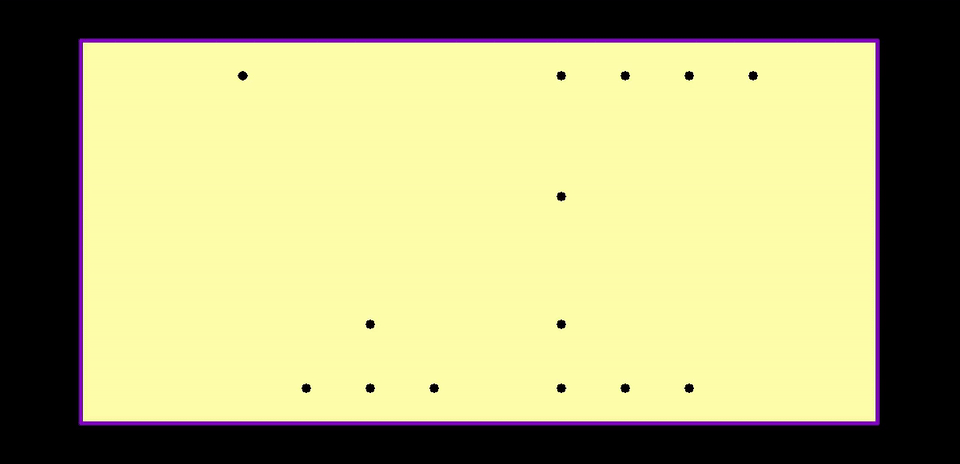

# DipTrace MCP

<!-- mcp-name: io.github.fireostendere/diptrace-mcp -->

[](https://github.com/fireostendere/mcp_diptrace/actions/workflows/ci.yml)
[](.github/workflows/ci.yml)

DipTrace MCP is a local Model Context Protocol server for reading, analysing,
reviewing, and performing guarded edits on DipTrace PCB and schematic projects.
It consists of:

- `diptrace-mcp`, the MCP server used by Codex, Claude Desktop, and other MCP
  clients;
- `diptrace_mcp_bridge.exe`, the Windows plug-in bridge for projects currently
  open in DipTrace;
- an internal EDA-intelligence layer for deterministic schematic/PCB intent,
  candidate generation, scoring and guarded improvement;
- an optional cinematic presentation layer for calibrated visible DipTrace UI
  replay and MP4/GIF capture.

## Headless cinematic example

[](i2c-level-shifter-demo.mp4)

This real DipTrace Schematic capture assembles a two-channel BSS138 I²C level
shifter: all 16 symbols appear one at a time, followed by the six electrical
nets. The recording was produced on an isolated Win32 desktop without taking
over the operator's cursor or keyboard. The editable source is
[`i2c-level-shifter.dchxml`](i2c-level-shifter.dchxml); the full-resolution
recording is [`i2c-level-shifter-demo.mp4`](i2c-level-shifter-demo.mp4).

### Autorouted PCB

[](i2c-level-shifter-pcb-demo.mp4)

The same converter is placed and routed as a 40 × 20 mm PCB in four captured
stages. The final board has 15 routed connections and no vias. The editable
board is [`i2c-level-shifter-pcb.dipxml`](i2c-level-shifter-pcb.dipxml), and the
deterministic generator is
[`scripts/build_i2c_level_shifter_pcb.py`](scripts/build_i2c_level_shifter_pcb.py).

The example is scoped presentation evidence for the validated host
configuration, not universal DipTrace compatibility or engineering sign-off.

## Current status

The source/package version remains `0.2.1`. The annotated `v0.2.1` GitHub
development prerelease and `diptrace-mcp==0.2.1` on PyPI were published on
2026-08-05 with:

- `DipTrace-MCP-Setup-0.2.1.exe`;
- `DipTrace-MCP-Portable-0.2.1.zip`;
- `DipTrace-MCP-0.2.1-windows.mcpb`;
- wheel, source distribution, checksums, SBOM, dependency, notice, provenance,
  and release records.

Development has continued on `main` after that immutable release. Current
post-release work includes the schematic layout/placement-routing foundation,
PCB Generations A-D, the 90% combined supported-environment coverage gate, and
cinematic UI calibration/replay. The initial 18-case real-DipTrace schematic
authoring/readability campaign is complete and its bounded fixes were merged by
PR #90. Those later `main` features are not retroactively part of the published
`v0.2.1` bytes.

The previous [`v0.2.0`](https://github.com/fireostendere/mcp_diptrace/releases/tag/v0.2.0)
and current `v0.2.1` release identities remain immutable. Existing tags and
published files are never replaced.

The Windows executables are unsigned. CI, SHA-256, PyPI Trusted Publishing, and
package attestations establish tested behaviour, byte identity, and publication
provenance. They do not create a trusted Authenticode signature, universal
compatibility, independent review, or production readiness.

## Public Release Status

The project uses the OSI-approved Apache-2.0 open-source `LICENSE`. Participation
and release controls are documented in `CONTRIBUTING.md`, `GOVERNANCE.md`,
`docs/LICENSE_DECISION.md`, `docs/PUBLIC_RELEASE_CHECKLIST.md`,
`docs/RELEASE_PROCESS.md`, `CHANGELOG.md`, and `CITATION.cff`. Security reports
use the private security channel; a verified Code of Conduct enforcement channel
is not yet published.

- Python archives are built from an exact allowlist and audited for entry
  points, packaged skills, bounds, metadata, and every `RECORD` hash and size.
- PyPI publication uses GitHub OpenID Connect and a protected `pypi`
  environment; no long-lived PyPI API token is stored.
- The PyPI publish job receives only the already validated wheel and source distribution
  from the separate build job.
- Windows installer, bridge, standalone executable, configurator, portable
  bundle, and MCPB remain unsigned development assets.
- CI, checksums, Trusted Publishing, and attestations do not create a
  code-signing or production-readiness claim.

## What it provides

The public MCP surface currently registers 167 tools. Runtime
`get_capabilities` remains authoritative for the active
installation and document.

Main public capability groups:

- PCB, schematic, Component Library, and Pattern Library reading and modelling,
  including the installed DipTrace catalog through a read-only bridge;
- structured DRC/ERC, connectivity, BOM, assembly, DFM/DFA/DFT, comparison, and
  signal-integrity assistance;
- guarded component, schematic, NetClass, text, trace, via, panelisation,
  placement, routing, and synchronisation workflows;
- preview, expected SHA-256, policy, backup, atomic replace, rollback, and
  live-session apply/cancel boundaries;
- optional Freerouting, ngspice, and openEMS process adapters;
- local stdio and trusted-loopback Streamable HTTP transports.

Internal EDA development deliberately does not expand that public tool surface
one heuristic at a time. The current schematic stack includes design intent and
reference motifs, hierarchical and bounded multi-candidate placement,
conservative pin-geometry resolution, non-mutating wire planning, pin-aware
joint placement/routing scoring, bounded placement repair, and selective atomic
replacement of affected existing wire geometry. `schematic_atomic_reroute.py`
rebuilds only affected explicit sheet-local nets as one dependency-safe
`delete_wire -> move_components -> add_wire` semantic batch while preserving
unaffected explicit geometry and the existing guarded transaction boundary.

The initial 18-case real-DipTrace schematic authoring/readability campaign is
complete. The final repaired stress schematic contained 22 parts, 48 pins,
16 nets, and 32 wires; it was operator-accepted and survived real DipTrace
Save/Close/Reopen/re-export with all 12 required schematic semantic categories
preserved. This is exact-scope product evidence, not a claim of globally optimal
layout, arbitrary hierarchy/topology support, or universal DipTrace compatibility.
Future schematic host retests are impact-based or tied to genuinely new claims.

The PCB design engine is implemented through four internal bounded generations:

- Generation A: engineering intent, functional blocks, net criticality and
  intent-aware placement v2;
- Generation B: stackup/reference context, conservative PDN/return-path/noise
  analysis and via roles;
- Generation C: routing-policy compilation, route ordering, observed-route SI
  checks, copper strategy and placement feedback;
- Generation D: lexicographically safe whole-board candidate selection and a
  synthetic engineering-trap benchmark catalog.

Missing current, edge rate, impedance, stackup authority, current density and
other physical facts remain explicit unknowns. PCB Generation D still requires
real-DipTrace product acceptance before stronger native-host claims are made.

`query_builtin_library_catalog` browses/searches DipTrace's installed read-only
catalog. `place_builtin_component` resolves one returned `catalog_id`, exports
that source through Component Editor on an isolated desktop, and copies only the
selected component/pattern definitions into the target schematic through the
normal preview/expected-SHA transaction path. It never writes the source
`.eli`/`.lib` file. The separate native Component/Pattern Library mutation core
remains internal and is not a public MCP write contract.

The cinematic subsystem can replay already-planned schematic/PCB actions through
a calibrated visible DipTrace UI and capture MP4/GIF demonstrations. It is a
presentation path, not the authoritative engineering write path: preview,
expected SHA, transaction and semantic validation remain authoritative. Exact
editor/version-specific calibration and UI macros still require real-client
validation.

DipTrace MCP is not a replacement for DipTrace's interactive EDA engine. It
does not claim native Gerber/NC Drill generation, fabrication sign-off,
Novarm/DipTrace endorsement, universal DipTrace 5.x compatibility, field-solver
accuracy, PI/EMC sign-off, or globally optimal schematic/PCB layout.

## Installation

### PyPI

Python 3.10 or newer is required:

```bash
python -m pip install diptrace-mcp==0.2.1
diptrace-mcp --help
```

The PyPI package installs the Python MCP server and packaged skills. It does not
install the Windows DipTrace bridge plug-in automatically. A current `main`
checkout may contain post-release development that is not present in this
published package.

### Windows installer

1. Download `DipTrace-MCP-Setup-0.2.1.exe` and `SHA256SUMS.txt` from the same
   `v0.2.1` GitHub Release.
2. Verify the SHA-256 value.
3. Run the installer and select the DipTrace location, workspace, state
   directory, and optional Codex/Claude configuration.
4. Restart DipTrace and the MCP client.
5. Call `get_capabilities`.

Windows may show a SmartScreen warning because the binaries are unsigned.

### Portable Windows bundle

Download and verify `DipTrace-MCP-Portable-0.2.1.zip`, extract it to a stable
location, read its `README_FIRST.txt`, and use the included helper tools.

### Python source installation

```bash
git clone https://github.com/fireostendere/mcp_diptrace.git
cd mcp_diptrace
python -m venv .venv
. .venv/bin/activate
python -m pip install -e .
diptrace-mcp --help
```

See [installation from release assets](docs/INSTALL_FROM_RELEASE.md) for the
complete path.

## MCPB, Registry, and Smithery

Version `0.2.1` is already published through the prepared distribution route:

- deterministic Windows MCPB packaging;
- canonical Registry identity `io.github.fireostendere/diptrace-mcp`;
- official Registry `server.json` generation from a public MCPB URL and verified
  SHA-256;
- Smithery/registry metadata preparation from the same immutable MCPB;
- PyPI Trusted Publishing for the Python server.

The MCPB contains the self-contained Windows stdio server. It does not silently
install the DipTrace bridge plug-in. Live exchange requires the matching bridge
and settings from the same GitHub release/source candidate.

See [MCP distribution and package publication](docs/MCP_DISTRIBUTION.md).

## Architecture

```text
MCP client (Codex / Claude / other)
                 |
                 | stdio or trusted loopback HTTP
                 v
             FastMCP
                 |
                 v
        application/service layer
                 |
                 +--> typed domain services
                 +--> internal EDA intelligence
                 |       +--> schematic layout / joint scoring / repair
                 |       +--> PCB Generations A-D
                 +--> shared stores, policy, cache, document gateway
                 |
                 v
        typed semantic operations
                 |
                 v
       guarded preview / SHA / transactions
                 |
                 v
       XML files / shared state
                 ^
                 |
       diptrace_mcp_bridge.exe
                 ^
                 |
              DipTrace

presentation-only branch:
planned actions -> calibrated cinematic replay -> visible UI / recording
```

Intelligent layout modules emit normal semantic operations/plans and stay behind
the existing preview/SHA/transaction/review safety path. Cinematic replay is not
a second semantic authority.

## Safety model

The main write invariants are:

1. paths remain inside configured allowed roots;
2. XML is bounded and parsed before mutation;
3. previews and commits are bound to exact SHA-256 values;
4. existing targets are backed up;
5. writes use temporary files and atomic replacement;
6. policy and conservative write-impact limits are enforced;
7. live apply rechecks the working, exchange, and original-file identities;
8. cancel preserves the host state for the exact accepted/tested paths and is
   not generalized to every future DipTrace/profile combination without evidence;
9. user-controlled sidecars cannot mint high trust;
10. internal EDA heuristics cannot silently invent physical facts or bypass the
    guarded semantic-operation path;
11. cinematic replay is presentation automation and is not semantic acceptance
    evidence by itself.

The private/manual Q1 Component Angle GUI/re-export campaign is PASS on DipTrace
PCB Layout 5.3.0.3. Package-owned public evidence/trust promotion remains a
separate reviewed contract, and the immutable `v0.2.1` release record correctly
retains its earlier `NOT_RUN` release-time status. Real Codex restart and an
operator-confirmed Claude Desktop restart on a separate machine are PASS.
The initial 18-case schematic product-quality campaign is PASS for its recorded
scope. All 12 blocking manual gates are PASS across the accepted checkpoints.

## Data Handling

- `DIPTRACE_MCP_WORKSPACE` selects the ordinary workspace; caller paths remain
  subject to `DIPTRACE_MCP_ALLOWED_ROOTS` and literal path checks.
- `DIPTRACE_MCP_STATE_DIR` stores local records plus live-session `original.xml`
  and `working.xml`; explicit `apply` or `cancel` controls finalisation.
- Freerouting, ngspice, and openEMS run only through typed local process
  boundaries and isolated job directories; online sourcing is disabled by
  default.
- MCP `stdio` keeps traffic on local process pipes and does not create a network
  listener.
- `streamable-http` is intended only for trusted loopback use, for example
  `127.0.0.1:8765`; OAuth and multi-user isolation are not implemented.
- User projects, private evidence, proprietary libraries, and screenshots are
  not uploaded or committed automatically; the operator controls external data
  and publication.

## Development and testing

The combined supported-environment coverage gate is 90%. The geometry-enabled
Linux full-suite job intentionally retains an 85% Linux-only floor; Linux
fallback, macOS and Windows coverage are combined for the repository-wide gate.
Selected critical modules also have dedicated per-file floors.

See [Testing](docs/TESTING.md) and [Development](docs/DEVELOPMENT.md).

## Documentation

- [Usage](docs/USAGE.md)
- [MCP tools and resources](docs/MCP_TOOLS.md)
- [Architecture](docs/ARCHITECTURE.md)
- [EDA intelligence map](docs/EDA_INTELLIGENCE.md)
- [Schematic layout engine](docs/SCHEMATIC_LAYOUT_ENGINE.md)
- [Schematic authoring validation campaign](docs/SCHEMATIC_AUTHORING_VALIDATION_2026-08-10.md)
- [Manual acceptance checkpoint](docs/MANUAL_ACCEPTANCE_CHECKPOINT_2026-08-09.md)
- [PCB design engine and A-D roadmap](docs/PCB_DESIGN_ENGINE.md)
- [Cinematic demo mode](docs/CINEMATIC_DEMO_MODE.md)
- [Placement engine](docs/PLACEMENT_ENGINE.md)
- [Domain model](docs/DOMAIN_MODEL.md)
- [MCP distribution and package publication](docs/MCP_DISTRIBUTION.md)
- [Windows and Python installation](docs/INSTALL_FROM_RELEASE.md)
- [Testing](docs/TESTING.md)
- [Roadmap](docs/ROADMAP.md)
- [XML compatibility](docs/XML_COMPATIBILITY.md)
- [Security and policy](docs/SECURITY_AND_POLICY.md)
- [Transactions](docs/TRANSACTIONS.md)
- [Release process](docs/RELEASE_PROCESS.md)
- [v0.2.1 release checklist](docs/RELEASE_0_2_1_CHECKLIST.md)
- [v0.2.1 release record](docs/releases/v0.2.1.md)

## Contributing, security, and license

Contributions use DCO 1.1 and the provenance/privacy rules in
[CONTRIBUTING.md](CONTRIBUTING.md). Report suspected vulnerabilities through the
private channel in [SECURITY.md](SECURITY.md), not public issues.

Apache License 2.0. See [LICENSE](LICENSE).
