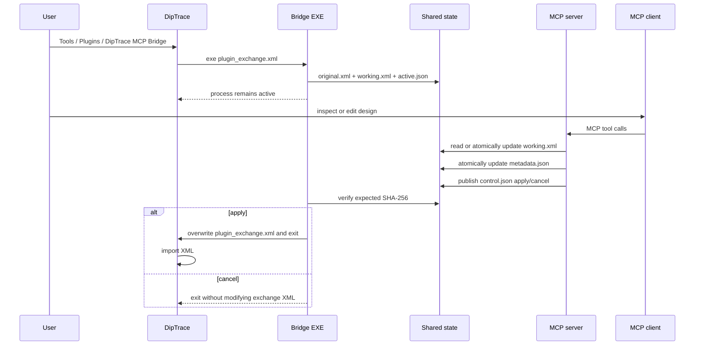

# DipTrace MCP Architecture

## Components

### MCP Server

`src/diptrace_mcp/server.py` creates the FastMCP server and registers tools, resources,
and prompts. It contains no file-format logic; calls are delegated to `DipTraceService`.

### Service Layer

`src/diptrace_mcp/service.py` is responsible for:

- allowed-path enforcement;
- selecting an offline file or the active `working.xml`;
- loading and validating XML;
- orchestrating preview, write, and backup operations;
- forwarding `apply` or `cancel` to the bridge process.

### XML Layer

`src/diptrace_mcp/xml_document.py` implements:

- validation of a `<Source Type="DipTrace-...">` root;
- document-size limits;
- rejection of `DOCTYPE` and `ENTITY` declarations;
- ElementTree-compatible XPath;
- exact match-count guards;
- a bounded set of edit operations;
- reparsing after modifications;
- SHA-256, diff generation, atomic writes, and backups.

### Inspector

`src/diptrace_mcp/inspector.py` understands the principal structures in the official XML format:

- `Source/Board/Components/Component`;
- `Source/Board/Nets/Net`;
- `Source/Schematic/Components/Part`;
- `Source/Schematic/Nets/Net`;
- PCB DRC, routing, net classes, and via styles;
- Schematic ERC and net classes.

Unknown sections remain accessible through `read_xml_fragment`.

### Scaffolding

`src/diptrace_mcp/scaffolding.py` generates brand-new schematic and PCB documents from
typed options (`SchematicScaffold`, `PcbScaffold`): sheets, board outline, copper layers,
layer stackup, via styles, net classes, and DRC defaults, following the official XML
specifications. Generated bytes are always parsed back through `DipTraceDocument` before
they reach the filesystem, and the service writes them atomically with an overwrite guard
and backup.

### Multi-Net Routing

`src/diptrace_mcp/multirouter.py` orchestrates sequential multi-net routing on top of
`routing.py` and the semantic compiler: each routed connection is committed to a working
document so later connections route around it, and a bounded rip-up/retry pass recovers
failures using batch-local candidates only. The ordered operation list replays through
the standard transactional preview/commit path.

### Bridge

`src/diptrace_mcp/bridge.py` is compiled into `diptrace_mcp_bridge.exe`. DipTrace starts
it with one positional argument: the path to `plugin_exchange.xml`.

## Live-Session Sequence



## Why DipTrace Waits

The official plug-in contract is synchronous. DipTrace creates an XML exchange file,
starts the plug-in executable, and reads the same file after the process exits. The
bridge must therefore remain active while MCP operations are being performed. A
separate state directory is necessary because `plugin_exchange.xml` is temporary and
owned by DipTrace.

## State Layout

```text
DipTraceMCP/
  active.json
  sessions/<session-id>/
    metadata.json
    original.xml
    working.xml
    control.json
    backups/
```

JSON and XML files are written through a temporary file in the same directory followed
by `os.replace`. This prevents readers from observing a partially written file.
`control.json` is published only after finish-request metadata is durable and acts as
the cross-process commit marker. JSON reads use a short bounded retry for transient
Windows sharing violations; malformed or persistently unreadable state still fails the
session explicitly.

## Safety Invariants

1. No more than one live session may be active at a time.
2. `Source@Type` cannot change within an edit call.
3. The `<Source>` root cannot be replaced or deleted.
4. Every edit specifies an exact `expected_matches` value.
5. `dry_run=true` is the default.
6. Commit requires the `expected_sha256` returned by preview.
7. A backup is created before writing.
8. The bridge reparses XML before `apply`.
9. The bridge verifies the hash stored in `control.json`.
10. Explicit `cancel` leaves the exchange XML unchanged.
11. A finish request publishes `control.json` only after `metadata.json` is complete.

## Trust Model

The server is designed for a trusted local MCP client. It restricts filesystem paths,
but a user or model can still intentionally request a structurally valid yet
engineering-invalid change. `apply_xml_edits` must therefore be treated as a confirmed
write tool.

Streamable HTTP should listen only on loopback. The project does not implement OAuth or
multi-user isolation.

## Plug-in Settings

Templates in `plugin/settings` follow the structure documented by the official DipTrace
plug-in specification:

```xml
<Source Type="DipTrace_Pcb_Plugin" Name="DipTrace MCP Bridge" ExeFile="diptrace_mcp_bridge.exe">
  <Settings>
    <ExpMode>All</ExpMode>
    <ImpMode>All</ImpMode>
    ...
  </Settings>
</Source>
```

`ExpMode=All` is required when the MCP server needs complete PCB or schematic context,
and `ImpMode=All` allows the returned full document to be imported. Component and Pattern
Editor profiles use the official `ExpMode=Library All` with `ImpMode=None`: they expose
the complete active library to the existing readers while keeping the live path
read-only until evidence-gated library writers exist. DipTrace reads plug-in folders and
`settings.xml` when the corresponding module starts, so module restart is required after
installing or changing plug-in settings.

## WSL Compatibility

The Windows bridge writes to `%LOCALAPPDATA%\DipTraceMCP`. A Linux process in WSL
accesses the same directory through
`/mnt/c/Users/<user>/AppData/Local/DipTraceMCP`. The protocol uses ordinary files only
and requires no Windows-to-WSL socket connection.

## Verified DipTrace Baseline

The live bridge design follows the official executable plug-in flow published by
Novarm: the module generates `plugin_exchange.xml`, passes its path to the configured
`.exe`, waits for completion, and then imports the updated file. This documentation was
reviewed against DipTrace 5.3.0.2 and the currently published 2024 plug-in specification.
