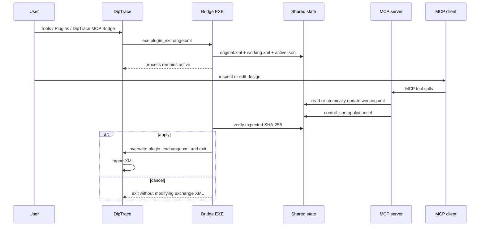

# Архитектура DipTrace MCP

## Компоненты

### MCP server

`src/diptrace_mcp/server.py` создаёт FastMCP-сервер и регистрирует tools, resource и prompt. Сервер не содержит логики формата: вызовы делегируются `DipTraceService`.

### Service layer

`src/diptrace_mcp/service.py` отвечает за:

- разрешённые пути;
- выбор offline-файла или активного `working.xml`;
- загрузку и проверку XML;
- orchestration preview/write/backup;
- передачу `apply`/`cancel` bridge-процессу.

### XML layer

`src/diptrace_mcp/xml_document.py` реализует:

- проверку корня `<Source Type="DipTrace-...">`;
- ограничение размера;
- запрет `DOCTYPE` и `ENTITY`;
- ElementTree-compatible XPath;
- точное число совпадений;
- ограниченный набор edit-операций;
- повторный parse после изменений;
- SHA-256, diff, atomic write и backup.

### Inspector

`src/diptrace_mcp/inspector.py` знает основные структуры официального XML:

- `Source/Board/Components/Component`;
- `Source/Board/Nets/Net`;
- `Source/Schematic/Components/Part`;
- `Source/Schematic/Nets/Net`;
- PCB DRC/routing/net classes/via styles;
- Schematic ERC/net classes.

Неизвестные разделы остаются доступны через `read_xml_fragment`.

### Bridge

`src/diptrace_mcp/bridge.py` компилируется в `diptrace_mcp_bridge.exe`. DipTrace запускает его с одним positional argument — путём к `plugin_exchange.xml`.

## Последовательность live-сессии



## Почему DipTrace ожидает

Официальный контракт плагина синхронный: DipTrace создаёт XML, запускает `.exe` и после завершения читает тот же XML. Поэтому bridge должен оставаться активным во время MCP-операций. Отдельный state directory нужен, потому что путь `plugin_exchange.xml` временный и принадлежит DipTrace.

## Состояние

```text
DipTraceMCP/
  active.json
  sessions/<session-id>/
    metadata.json
    original.xml
    working.xml
    control.json
    backups/
```

Записи JSON и XML выполняются через временный файл в том же каталоге и `os.replace`. Это предотвращает чтение частично записанного файла.

## Инварианты безопасности

1. Одновременно существует не более одной активной live-сессии.
2. `Source@Type` не может измениться в рамках edit-call.
3. Корень `<Source>` нельзя заменить или удалить.
4. Каждый edit указывает точное `expected_matches`.
5. `dry_run=true` используется по умолчанию.
6. Commit требует `expected_sha256` из preview.
7. Перед записью создаётся backup.
8. Bridge повторно парсит XML перед `apply`.
9. Bridge проверяет hash из `control.json`.
10. Явный `cancel` не изменяет exchange XML.

## Доверительная модель

Сервер предназначен для локального доверенного MCP-клиента. Он ограничивает файловые пути, но пользователь и модель могут намеренно запросить структурно допустимую, инженерно неверную правку. Поэтому `apply_xml_edits` следует считать write-инструментом с подтверждением.

HTTP transport следует слушать только на loopback. Проект не реализует OAuth или multi-user isolation.

## Plugin settings

Шаблоны в `plugin/settings` повторяют структуру штатных плагинов DipTrace:

```xml
<Source Type="DipTrace_Pcb_Plugin" Name="DipTrace MCP Bridge" ExeFile="diptrace_mcp_bridge.exe">
  <Settings>
    <ExpMode>All</ExpMode>
    <ImpMode>All</ImpMode>
    ...
  </Settings>
</Source>
```

`All` нужен, чтобы MCP видел полный контекст и мог вернуть целостный документ. Для узкого read-only плагина можно создать отдельный settings profile с `Partial` и `ImpMode=None`, но он не сможет применить общие изменения.

## Совместимость WSL

Windows bridge пишет `%LOCALAPPDATA%\DipTraceMCP`. Linux-процесс в WSL обращается к тому же каталогу через `/mnt/c/Users/<user>/AppData/Local/DipTraceMCP`. Протокол состоит только из обычных файлов и не требует сокетов между Windows и WSL.
