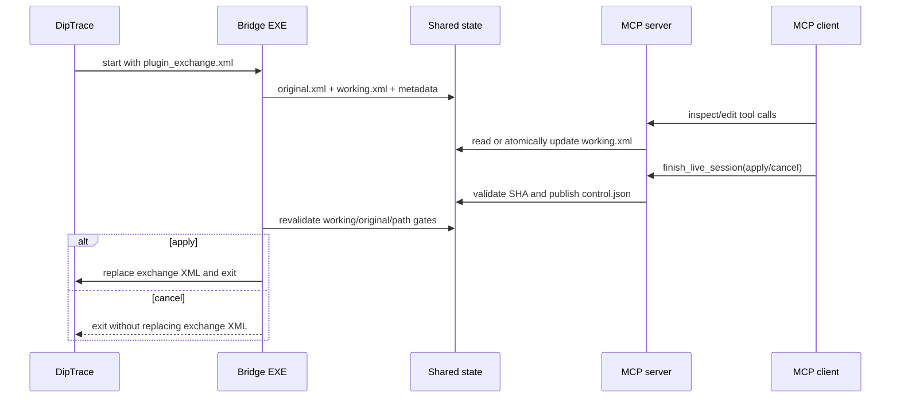

# DipTrace MCP Architecture

## Scope

DipTrace MCP is a local MCP server with an optional Windows executable bridge
for designs opened in DipTrace. The architecture separates protocol exposure,
use-case orchestration, domain logic, persistence, XML safety, and the external
DipTrace exchange process.

The current source/package version is `0.2.0`. Version `v0.1.2` remains the
latest published release; the 0.2.0 tree is an unpublished release candidate.

## High-level flow

```text
MCP client
(Codex / Claude / other)
        |
        | stdio or loopback Streamable HTTP
        v
src/diptrace_mcp/server.py
        |
        v
DipTraceService public Facade
        |
        +--> typed in-process domain services
        +--> policy, stores, model cache, document gateway
        |
        v
XML files and shared state
        ^
        |
diptrace_mcp_bridge.exe
        ^
        |
DipTrace executable XML plug-in contract
```

There is no RPC layer between the Facade and domain services. Services are
ordinary synchronous Python objects. `server.py` owns the asynchronous MCP
boundary and offloads every registered tool through the project-owned AnyIO
worker-thread wrapper.

## MCP server

`src/diptrace_mcp/server.py` creates the FastMCP server and registers tools,
resources, prompts, transport configuration, and the public error boundary. It
contains no DipTrace file-format implementation. Calls are delegated to the
stable `DipTraceService` Facade.

The public contract currently contains 159 tools. The full wire-level
`tools/list` model is frozen in
`reference/mcp-tools-list.snapshot.json` and checked in CI.

## Service Facade and domain services

`src/diptrace_mcp/service.py` remains the public Facade and top-level dependency
owner. It creates shared stores, policy, cache, trust registry, and the single
`DocumentGateway`, then constructs each domain service once.

Domain implementations live under `src/diptrace_mcp/services/`:

- `DocumentService`: normalised documents, selectors, models, connectivity,
  resources, and bounded XML reads;
- `BomService`: BOM and component/library metadata reads;
- `ReviewService`: review reports, findings, and read-only engineering analysis;
- `DiscoveryService`: document discovery;
- `ExportService`: bounded export records and artifacts;
- `JobService`: job records and resources;
- `ExternalJobsService`: Freerouting, ngspice, and openEMS orchestration;
- `RoutingService`: routing analysis, plans, and apply paths;
- `PlacementService`: placement and silkscreen planning/apply paths;
- `SemanticOperationsService`: explicit semantic-operation wrappers;
- `SemanticEngineService`: guarded semantic execution and preview;
- `SynchronizationService`: schematic-to-PCB synchronisation;
- `XmlWriteService`: guarded raw XML edits and raw previews;
- `ScaffoldingService`: synthetic and seed-based document creation;
- `TransactionService`: transaction preview, commit, rollback, and recovery;
- `EvidenceService`: provenance, comparison, and fail-closed trust;
- `LiveSessionService`: live-session lifecycle operations.

`ServiceContext` shares only exact typed dependencies. `DocumentGateway` is the
single path/session-aware document loader and document-target registry. Domain
services do not import or hold the complete Facade and do not create duplicate
stores, caches, sessions, transactions, or policies.

The remaining Facade responsibilities are intentionally limited to:

- top-level dependency assembly and singleton ownership;
- allowed-root and literal caller-path resolution;
- capability/status reporting and prompt registration;
- compatibility wrappers for existing private seams;
- callbacks for SHA gates, atomic writes, provenance sidecars, trust
  invalidation, and stored-plan application.

The complete method inventory and parity checks are documented in
[`SERVICE_DECOMPOSITION.md`](SERVICE_DECOMPOSITION.md). The current contract
contains 157 public Facade methods, 148 explicit delegations, and nine
Facade-owned public methods.

## Shared state and dependency ownership

One server instance owns one instance of each stateful dependency:

```text
DipTraceService
├── Settings / Policy
├── DocumentGateway
├── ModelCache
├── SessionStore
├── TransactionStore
├── PlanStore
├── FindingStore
├── JobStore / ExternalJobManager
├── ExportStore
├── BackupStore
├── RawPreviewStore (lazy)
├── TrustedProvenanceRegistry (package-owned)
└── domain services
```

Persistent records are stored below the configured state directory. The main
state layout is:

```text
DipTraceMCP/
  active.json
  offline_backups/<canonical-target-sha256>/
  transactions/
  jobs/
  plans/
  exports/
  reviews/
  raw_previews/
  sessions/<session-id>/
    metadata.json
    original.xml
    working.xml
    control.json
    backups/
```

Record stores validate identifiers and confined paths before reading or
removing entries. Retention is count-and-age based and protects active,
nonterminal, corrupt, redirected, or otherwise unverifiable state. Cleanup
limits are soft targets, not guaranteed storage quotas.

## XML layer

`src/diptrace_mcp/xml_document.py` provides the core file-safety boundary:

- bounded document reads;
- root/source-type validation;
- layered rejection of `DOCTYPE` and `ENTITY` declarations;
- source encoding, byte-order, BOM, and line-ending detection;
- exact match-count guards;
- bounded raw and semantic edits;
- preservation of supported UTF-8, UTF-16LE/BE, US-ASCII, and ISO-8859-1
  representations outside targeted regions;
- reparsing and semantic-tree checks after modification;
- SHA-256, bounded diffs, backups, and atomic replacement.

Unsupported or ambiguous input fails closed. Clean UTF-32 is not accepted as a
normal write source. Non-finite numeric values are rejected before they can
enter geometry, rules, or comparison logic.

## Normalised models and cache

Adapters and inspectors convert the supported PCB, schematic, Component
Library, and Pattern Library XML structures into typed domain models. Unknown
sections remain available through bounded XML-fragment reads and are preserved
by targeted edits.

`ModelCache` keys snapshots by resolved path, source SHA-256, and live-session
state. It applies LRU entry and estimated-byte budgets. A snapshot larger than
the configured budget may be returned to the current caller but is not retained.

## Scaffolding and seed-based creation

`ScaffoldingService` can create synthetic PCB and schematic XML from typed
options. The structure follows project-owned observations and the maintained
4.3-era scaffold model; changing the literal `format_version` is not a format
conversion and does not establish compatibility with a particular DipTrace
build.

`create_document_from_seed` instead copies a real user-supplied DipTrace-exported
XML seed while preserving unknown content and provenance constraints. Neither
path automatically grants high-trust round-trip status.

New targets require no target SHA. Replacing an existing target requires
`overwrite=true` and the current `expected_sha256`, followed by backup and
atomic replacement.

## Semantic write and transaction flow

High-level semantic writes use the same guarded sequence:

```text
load exact source bytes
  -> validate policy and source SHA
  -> parse typed operation(s)
  -> build modified bytes
  -> reparse and run bounded checks
  -> compute conservative write impact
  -> preview / transaction record
  -> require expected SHA at commit
  -> backup existing bytes
  -> atomic replacement
  -> update provenance/trust state
```

Transactions persist snapshots and metadata for preview, validation, commit,
rollback, and recovery. Exact conflict-checked rollback is the only write-impact
restoration exemption and still passes the active policy.

The conservative write-impact gate counts both normalised objects and exact XML
elements. These views may overlap, so a change affecting fewer than 500 unique
physical objects may still be refused rather than undercounted.

## Review, placement, and routing

Review services persist structured findings and explicit skip/partial status.
They do not convert incomplete geometry or unavailable rules into a clean
result. The authoritative implementation matrix is
[`REVIEW_ENGINE.md`](REVIEW_ENGINE.md).

Placement and routing are bounded engineering helpers:

- deterministic silkscreen and local placement plans;
- trace/via primitives and multi-layer 45-degree A*;
- congestion-ordered multi-net routing with bounded batch-local rip-up/retry;
- centreline-based coupled differential-pair routing;
- DSN export and guarded SES inspection/import.

They are not equivalent to a full global placer, push-and-shove router, or
free-angle EDA engine.

## External process boundary

Freerouting, ngspice, and openEMS use typed server-selected command vectors and
a shared bounded runner. Processes start with `shell=false`, in isolated job
directories, with continuously drained bounded output tails and one global
concurrency budget.

POSIX jobs use process groups for timeout/cancellation cleanup. Windows jobs use
Job Objects with kill-on-close semantics and explicit root-process reaping.
External availability is runtime-dependent and separate from core parser/write
trust.

## Windows live bridge

`src/diptrace_mcp/bridge.py` is compiled into `diptrace_mcp_bridge.exe`.
DipTrace invokes it with a temporary `plugin_exchange.xml` path and waits for the
process to exit.

The bridge copies the source into a session state directory, records the native
exchange path and its original SHA-256, and remains active while MCP operations
inspect or modify `working.xml`.


```mermaid
sequenceDiagram
    participant D as DipTrace
    participant B as Bridge EXE
    participant S as Shared state
    participant M as MCP server
    participant C as MCP client

    D->>B: start with plugin_exchange.xml
    B->>S: original.xml + working.xml + metadata
    C->>M: inspect/edit tool calls
    M->>S: read or atomically update working.xml
    C->>M: finish_live_session(apply/cancel)
    M->>S: validate SHA and publish control.json
    B->>S: revalidate working/original/path gates
    alt apply
        B->>D: replace exchange XML and exit
    else cancel
        B-->>D: exit without replacing exchange XML
    end
```

A Windows-origin session keeps the exchange path in Windows syntax. A WSL
server derives `/mnt/<drive>/...` only in memory. Persisting a translated WSL
path into Windows-origin metadata is invalid and fails closed.

The executable plug-in protocol provides no explicit DipTrace-host import
acknowledgement after process exit. Local finalisation reports therefore remain
bounded to `applied`, `cancelled`, or `not_acknowledged` rather than claiming
host confirmation.

## Safety invariants

1. Caller-controlled paths remain inside configured allowed roots.
2. The XML root/source type cannot be silently replaced.
3. Raw edits require exact match counts.
4. `dry_run=true` is the default where exposed.
5. Commit/apply requires the caller-observed expected SHA-256.
6. Existing targets are backed up before replacement.
7. All persistent JSON/XML writes use same-directory temporary files and
   atomic replacement.
8. Live apply rechecks the working SHA, exchange path, original exchange SHA,
   and write impact before replacement.
9. Explicit cancel leaves the exchange XML unchanged.
10. User-controlled evidence cannot grant package-owned high trust.
11. Streamable HTTP is intended for loopback use; OAuth and multi-user isolation
    are not implemented.

## Evidence boundary and known gaps

Controlled live evidence exists for selected DipTrace 5.3 schematic and
DipTrace 5.2.0.4 PCB/Schematic workflows. It does not establish universal
DipTrace 5.x compatibility.

The capability report intentionally retains unresolved trust-invalidation
coverage for:

- `plan_apply`;
- `ses_import`;
- `schematic_to_pcb_sync`;
- `live_session_apply`.

Q1 Component Angle GUI/re-export evidence remains `NOT_RUN`; rotation output
must retain its warning. Native library writers, native manufacturing outputs,
and broad redistributable DipTrace 5.3 fixtures remain outside the verified
boundary.

## Packaging boundary

The Python wheel contains the MCP server and packaged skills. Complete Windows
live integration additionally requires the separately built bridge, settings,
standalone server, configurator, installer, or portable bundle.

The 0.2.0 Windows assets build in CI but are not published while the release
candidate remains untagged. Candidate executables are unsigned unless a real
protected signing workflow is completed and every executable verifies.